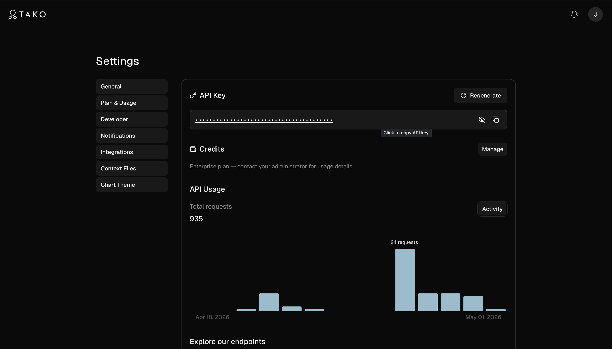
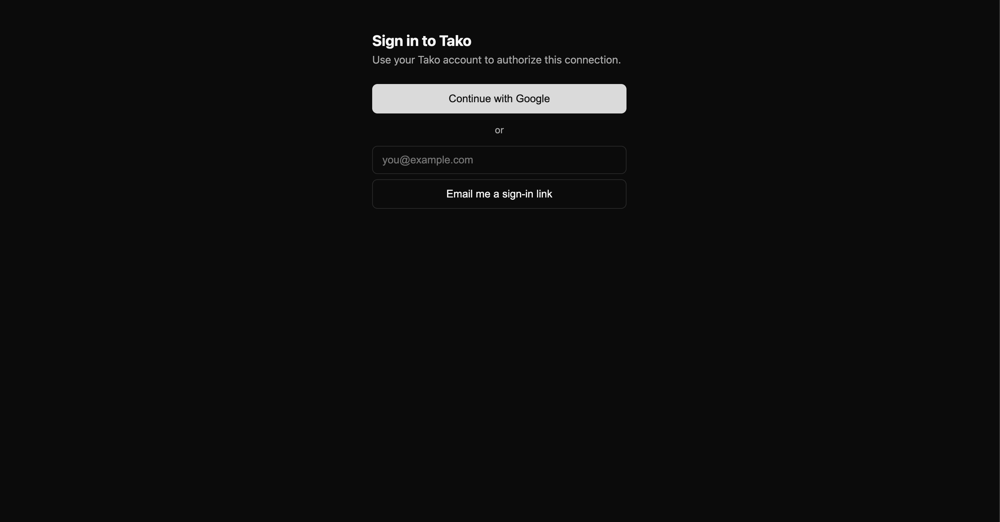
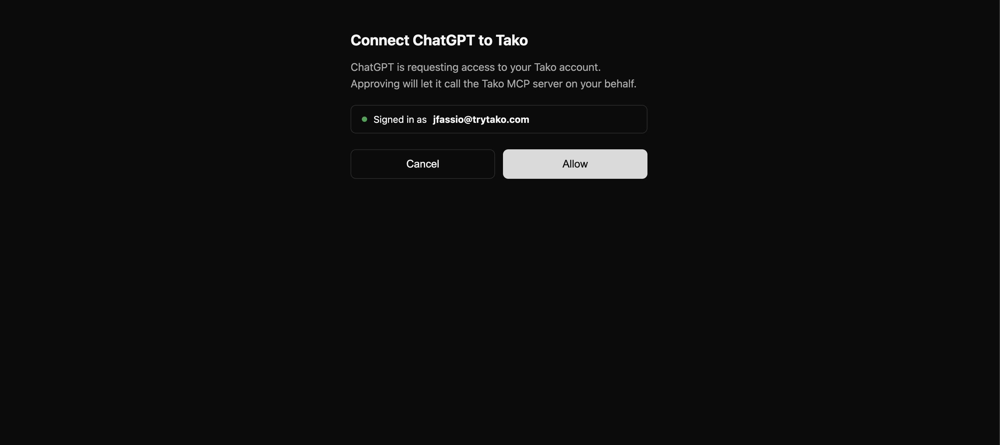
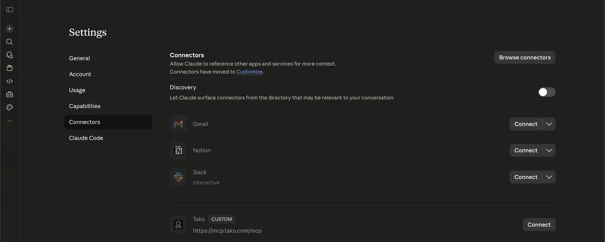
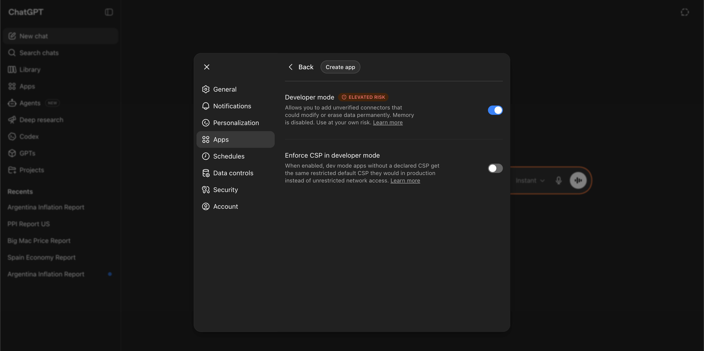
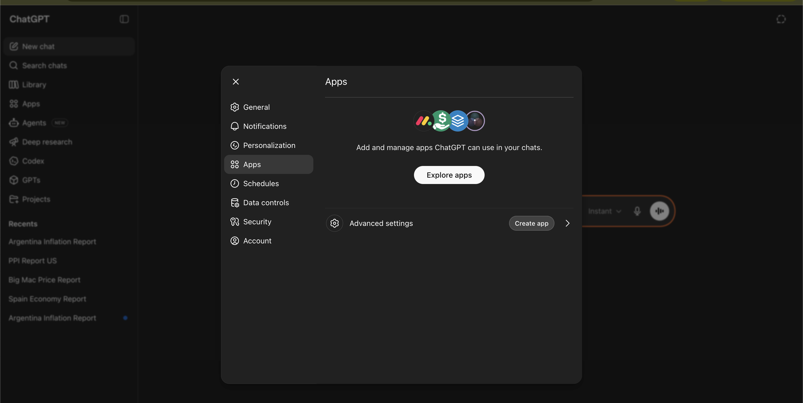
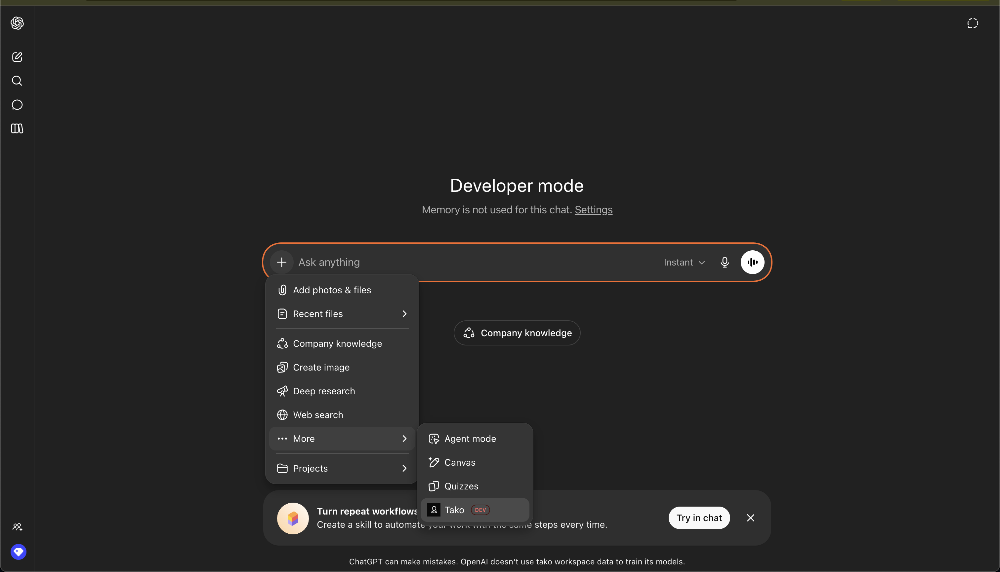

# Tako MCP Server

An MCP (Model Context Protocol) server that provides access to Tako's knowledge base and data visualizations.

## What is this?

This MCP server enables AI agents to:

- **Search** Tako's knowledge base for charts and data visualizations
- **Answer** data questions with grounded, citation-backed prose
- **Fetch** underlying content (CSV or text) behind result URLs
- **Run** deep multi-step research with Tako's agent

## Quick start

**Use the hosted endpoint at `https://mcp.tako.com`.** Three lines, no install:

```bash
export TAKO_API_TOKEN='<your-token-from-tako.com>'
claude mcp add tako-mcp --transport http https://mcp.tako.com/mcp \
  --header "Authorization: Bearer $TAKO_API_TOKEN"
```

That's it for new users. Detailed configs for Claude Code / Claude Desktop / Cursor / Windsurf are in the next section.

## Hosted (Cloudflare Workers)

The fastest path: point your MCP client at `https://mcp.tako.com` with a Bearer token. No install, no local server.

**Endpoints:**

| Environment | URL |
|---|---|
| Production | `https://mcp.tako.com/mcp` |
| Staging (testing only) | `https://mcp.staging.tako.com/mcp` |

**Authentication:** every request needs `Authorization: Bearer <TAKO_API_TOKEN>`. Get a token at [tako.com](https://tako.com) → account settings → API tokens.

### Claude Code

```bash
export TAKO_API_TOKEN='<your-token>'

claude mcp add tako-mcp --transport http https://mcp.tako.com/mcp \
  --header "Authorization: Bearer $TAKO_API_TOKEN"
```

Verify with `claude mcp list` (should show `tako-mcp` connected) or `/mcp` inside a session.

### Claude Desktop

Edit `~/Library/Application Support/Claude/claude_desktop_config.json` (macOS) or `%APPDATA%\Claude\claude_desktop_config.json` (Windows):

```jsonc
{
  "mcpServers": {
    "tako-mcp": {
      "type": "http",
      "url": "https://mcp.tako.com/mcp",
      "headers": {
        "Authorization": "Bearer <your-tako-api-token>"
      }
    }
  }
}
```

Restart Claude Desktop. `Tako MCP` should appear in the available tools list.

### Cursor / Windsurf

Add to `~/.cursor/mcp.json` (Cursor) or the equivalent Windsurf config:

```jsonc
{
  "mcpServers": {
    "tako-mcp": {
      "type": "http",
      "url": "https://mcp.tako.com/mcp",
      "headers": {
        "Authorization": "Bearer <your-tako-api-token>"
      }
    }
  }
}
```

### Notes

- **Tools are discovered automatically** via the MCP `tools/list` handshake on connect — your client always sees the current tool surface, no manual list to keep in sync.
- **Auth is connection-level Bearer** — once the connection is established with your token, tool inputs require no `api_token` argument.
- **Use the staging endpoint** (`mcp.staging.tako.com`) for testing changes against an unstable build before they reach `mcp.tako.com`.

## Consumer hosts (OAuth)

Use this if you're connecting Tako from **Claude.ai** or **ChatGPT** — the consumer chat hosts that don't accept Bearer tokens. The hosted endpoint at `https://mcp.tako.com/mcp` runs an OAuth 2.1 flow that signs you in with your Tako account and connects on your behalf, no JSON config or CLI required.

> If you're using Claude Code, Claude Desktop, Cursor, or Windsurf, see the Bearer-auth instructions [above](#hosted-cloudflare-workers) — those clients accept a static `Authorization: Bearer` header and don't need OAuth.

### Prerequisites

Before connecting from Claude.ai or ChatGPT:

1. **Sign up or sign in at [tako.com](https://tako.com).**
2. **Mint an API token** at tako.com → settings → API tokens.

Step 2 is no longer required: the consent flow mints a per-host Tako API key for
you on first authorize (named "MCP: <client>", visible and revocable at
trytako.com → settings → API tokens). Minting is additive — connecting a new
host never rotates another host's key — and Tako trims your oldest MCP key once
you exceed ten. You only see a "too many API keys" page if your account is at
the overall key cap, in which case revoke one and reconnect.



### What you'll see during connect

The same three Tako-hosted screens appear regardless of which host (Claude.ai or ChatGPT) you're connecting from:

1. **Tako sign-in page.** Two options: **Continue with Google** or send yourself an **email magic-link**. Use the same identity you signed up with at tako.com.

   

2. **Tako consent page.** Reads *"Connect [host name] to Tako — Signed in as you@example.com — Allow / Cancel"*. Click **Allow** to authorize the connection.

   

3. **Bounce back to the host.** The connector is now listed and tools are callable.

The host itself (Claude.ai or ChatGPT) may also display its own consent prompt before or after Tako's. That's normal — Tako confirms it's safe to share your account; the host confirms it's safe to invoke an external connector.

### Claude.ai

*Requires Claude.ai Pro, Max, Team, or Enterprise.*

1. Open Claude.ai → **Settings → Connectors**.

   

2. Click **Add custom connector**.

   > _[Screenshot: Claude.ai "Add custom connector" dialog]_

3. Paste `https://mcp.tako.com/mcp` and click **Connect**.

4. You'll be taken through the Tako sign-in flow described above.

5. After consent, **Tako** appears in your connector list as connected.

   

### ChatGPT

*Requires ChatGPT Pro, Business, or Enterprise. Developer Mode must be enabled.*

1. Open ChatGPT → **Settings → Connectors → Developer Mode** and toggle it on if it isn't already.

   

2. Click **Create custom connector**.

   

3. Paste `https://mcp.tako.com/mcp` and click **Connect**.

4. You'll be taken through the Tako sign-in flow described above.

5. After consent, the connector is listed and ready to use.

   

### Verify it's working

In a fresh conversation, ask:

> Show me Tako's chart on Intel vs Nvidia headcount.

A successful response includes a chart link or an inline chart render (depending on host) within a few seconds. If you instead see an authentication error, jump to *Disconnecting & re-authorizing* below.

### Disconnecting & re-authorizing

There are two ways to break the connection, and they have different blast radius. Pick the one that matches what you actually want.

**Per-host disconnect** (Claude.ai or ChatGPT settings → remove the Tako connector). Stops *that host* from making MCP calls. Does **not** revoke the underlying Tako API token. Other connected hosts — and any Claude Code / Cursor Bearer-auth wiring on the same account — keep working unchanged.

**Rotate the API token at [tako.com](https://tako.com) → settings → API tokens.** This is the hard kill switch. Rotating creates a new token and invalidates the old one server-side, which means every previously-issued OAuth grant — across every host — stops authenticating immediately. To resume from any host, disconnect and reconnect; the new consent flow picks up your fresh token.

> This kill-switch behavior is by design for v1. Per-grant scoped tokens (revoke a single host without touching the others) are tracked under [TAKO-2679](https://linear.app/tako/issue/TAKO-2679)'s known limitations.

## Available Tools

Tools are discovered automatically via the MCP `tools/list` handshake; your client always sees the live surface. Auth is connection-level (Bearer token or OAuth) — there is no per-call `api_token` argument.

- **`tako_search`** — Fast search over Tako's curated knowledge graph (and the live web when asked) for charts and live data on any topic. The top result auto-renders inline as an interactive chart on hosts that support MCP Apps (Claude.ai, ChatGPT). Choose `sources` (`["tako"]` default, `["web"]`, or both) and `effort` (`fast` default | `instant`). For deep, multi-step research — or when search returns nothing — use `tako_agent`.
- **`tako_answer`** — Get a single grounded, citation-backed prose answer. Ground in `["tako"]`, `["web"]`, or both (default).
- **`tako_contents`** — Fetch the content behind a result URL: a Tako card URL returns a CSV; any other URL returns the page's extracted text.
- **`tako_visualize`** — Create an embeddable chart/card directly from your own structured data (Tako's [Thin-Viz](https://tako.com/docs/) API). Supply typed `components` (timeseries, bar, table, financial boxes, …); the card auto-renders inline and returns `webpage_url` / `embed_url`.
- **`tako_agent`** — Run Tako's deep research agent for complex, multi-step data questions. Returns a synthesized answer plus supporting chart cards. (On ChatGPT this is exposed as the `tako_agent_start` / `tako_agent_wait` pair to fit the host's tool-call timeout model.)
- **`get_credit_balance`** — Check the connected account's API credit balance.

## Example Flow

1. User asks: "Show me a chart about Intel vs Nvidia headcount"
2. Agent calls `tako_search` with the query
3. Agent receives chart results with IDs and URLs; the top result renders inline on supported hosts
4. Agent calls `tako_answer` to get a grounded prose answer with citations

## Breaking changes (v0.3.0)

- The current tool surface is: **`tako_search`**, **`tako_answer`**, **`tako_contents`**, **`tako_visualize`**, **`tako_agent`** (plus the ChatGPT split pair **`tako_agent_start`** / **`tako_agent_wait`**), and **`get_credit_balance`**.
- The chart-image (`get_chart_image`), interactive-chart (`open_chart_ui`), chart-creation (`create_chart`), and report tools (`create_report`, `get_report`, `list_reports`, `export_report`) were removed.
- The self-hosted Python server (`pip install tako-mcp` / Docker) was removed in favor of the hosted Cloudflare Worker.

Update any client config or agent prompts that referenced the old tool names or the Python SSE endpoint.

## Health Checks

- `GET /health` - Simple "ok" response

## Architecture

Tako MCP is a Cloudflare Worker — a thin TypeScript proxy deployed at `mcp.tako.com`:

```
AI Agent (Claude Code/Desktop, Cursor, Claude.ai, ChatGPT, etc.)
    ↓
  MCP Protocol (Streamable HTTP, POST /mcp)
    ↓
Cloudflare Worker  ──  Bearer auth / OAuth, tool dispatch
    ↓
Tako Django API  (api.tako.com)
```

The Worker extracts the Bearer token (or OAuth-derived token), validates the MCP request, calls the appropriate Django endpoint with the user's token forwarded as `X-API-Key`, and returns structured tool results. Code lives in `workers/` of this repo.

## MCP Registry (maintainers)

Tako is published to the official [MCP Registry](https://registry.modelcontextprotocol.io)
as a remote server under the name `io.github.TakoData/tako-mcp`.

- **`server.json`** (repo root) is the registry descriptor: a remote
  `streamable-http` entry pointing at `https://mcp.tako.com/mcp`. The registry
  schema does not list tools — hosts discover them at runtime via `tools/list`.
  (This is distinct from `registry/server.json`, the generated in-repo tool
  catalog used by `npm run registry:gen` / `registry:check`.)
- **Publishing** is automated by `.github/workflows/publish-mcp.yml`. It
  authenticates with the registry via **GitHub OIDC** (no secret — the
  `io.github.TakoData/*` namespace is authorized because this repo lives in the
  TakoData org) and runs `mcp-publisher publish`. **The version lives in code:**
  bump `server.json`'s `version` and merge to `main` and it publishes
  automatically. A merge that touches `server.json` without changing the version
  is a no-op (the workflow skips, so the registry never sees a duplicate). Manual
  `workflow_dispatch` publishes the checked-in version on demand.
- **Branded namespace (`com.tako/tako-mcp`)** is an optional future upgrade. It
  requires DNS authentication: generate an Ed25519 key, add a `TXT` record on
  `tako.com`, and swap the workflow's `login github-oidc` step for
  `login dns --domain tako.com --private-key ${{ secrets.MCP_PRIVATE_KEY }}`.

## License

MIT License - see [LICENSE](LICENSE) for details.

## Links

- [Tako](https://tako.com) - Data visualization platform
- [Tako on Smithery](https://smithery.ai/servers/tako/tako) - MCP server listing (hosted Worker at `mcp.tako.com/mcp`)
- [Tako on the MCP Registry](https://registry.modelcontextprotocol.io) - `io.github.TakoData/tako-mcp`
- [MCP Specification](https://spec.modelcontextprotocol.io/) - Model Context Protocol
