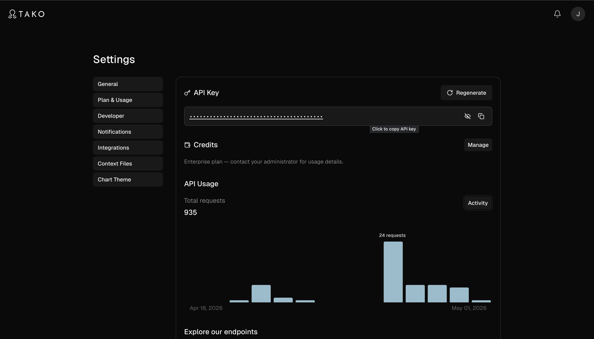
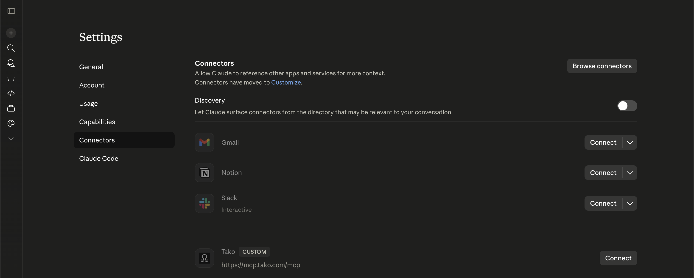
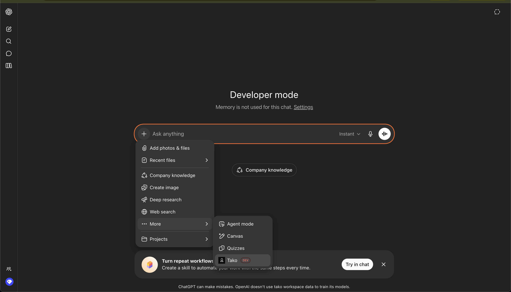
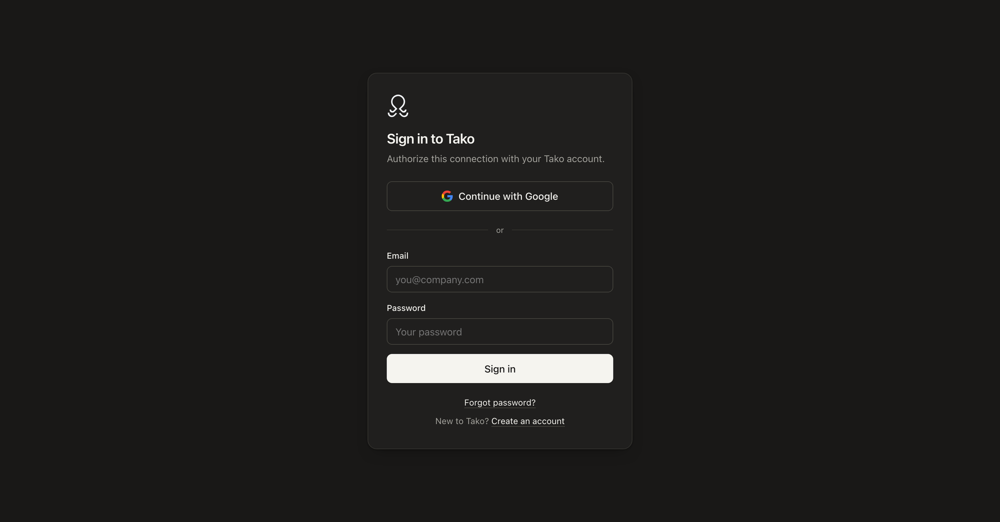
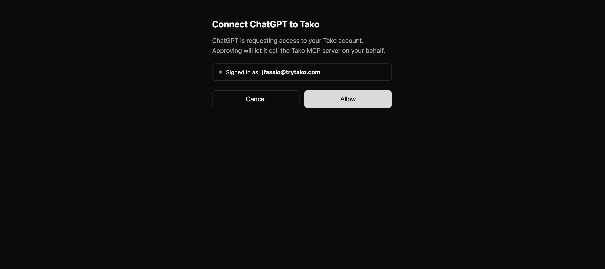

# Tako MCP Server

[](https://docs.tako.com/documentation/integrations/mcp-server)
[](https://registry.modelcontextprotocol.io)
[](https://smithery.ai/servers/tako/tako)
[](https://lobehub.com/mcp/takodata-tako-mcp)
[](LICENSE)
[](https://tako.com/blog/evaluating-a-new-kind-of-search-api/)

Tako MCP gives your agent industry-leading live web search plus licensed data that the open web does not have. That includes company financials, macroeconomic indicators, web and app traffic, sports, US government spending, and more.

**[Full Documentation](https://docs.tako.com/documentation/integrations/mcp-server)** · **[Get your API key](https://tako.com/console/api-keys)** · **[MCP Registry](https://registry.modelcontextprotocol.io)**

Tako MCP lets an agent:

- **Search** Tako's knowledge graph and the live web — top result renders inline as a chart, and `tako_contents` reads the rows behind it
- **Discover** exactly what proprietary data exists for an entity or metric — free and fast
- **Fetch** the underlying rows (JSON) or a page's text behind any result URL
- **Visualize** your own structured data as an embeddable card — public and permanent, readable by anyone with the link _(opt-in; on by default on the ChatGPT app)_
- **Run** Tako's Answer Agent for deep, multi-step research _(opt-in)_

> **Why a data-native search API?** On Tako's [VerticalRTK benchmark](https://tako.com/blog/evaluating-a-new-kind-of-search-api/) of real-time domain questions (finance, economics, sports, weather), Tako outperforms the next-best web search API by **21%** — while using **~75% fewer tool calls at up to one-tenth the cost**, and answering research tasks in **15.5s vs 124.2s** for OpenAI web search. It reaches parity with Exa, Parallel, Nimble, and Tavily on standard web benchmarks (SimpleQA, FRAMES) and pulls ahead where structured, real-time data matters. **[Read the evals →](https://tako.com/blog/evaluating-a-new-kind-of-search-api/)**

## Installation

Point your MCP client at the hosted endpoint — no install, no local server, no token:

```
https://mcp.tako.com/mcp
```

Paste the URL. Sign in when your client prompts you — a per-host key is minted automatically, and new accounts get up to 2,000 free requests. Until you sign in, the connection runs anonymously: `tako_search` works right away (rate-limited), and every other tool — listed like everything else — asks you to sign in when called. For CI, headless use, or a client without an OAuth flow, connect with an API key instead — see [API keys and headless clients](#api-keys-and-headless-clients).

### One-click install

[](https://cursor.com/install-mcp?name=tako&config=eyJ1cmwiOiJodHRwczovL21jcC50YWtvLmNvbS9tY3AifQ==)
[](https://insiders.vscode.dev/redirect/mcp/install?name=tako&config=%7B%22type%22%3A%22http%22%2C%22url%22%3A%22https%3A%2F%2Fmcp.tako.com%2Fmcp%22%7D)
[](https://insiders.vscode.dev/redirect/mcp/install?name=tako&config=%7B%22type%22%3A%22http%22%2C%22url%22%3A%22https%3A%2F%2Fmcp.tako.com%2Fmcp%22%7D&quality=insiders)

Claude Code installs with one command — the plugin brings the MCP connection plus Tako's bundled [research skills](#agent-skills):

```bash
claude plugin marketplace add TakoData/tako-mcp && claude plugin install tako@tako
```

Gemini CLI installs as an extension. Same one command, same bundled skills, plus `/data`, `/chart`, and `/coverage` commands:

```bash
gemini extensions install https://github.com/TakoData/tako-mcp
```

Each of these lands on the free tier immediately. Authenticate later to unlock the full toolset — see your client's section below.

Pick your client below.

<details>
<summary><b>Claude Code</b></summary>

**Plugin (recommended)** — installs the MCP connection plus Tako's bundled [research skills](#agent-skills) in one step, and works immediately on the free tier — no API key to mint or manage:

```bash
claude plugin marketplace add TakoData/tako-mcp
claude plugin install tako@tako
```

That's it — `tako_search` works right away on the anonymous free tier. To unlock the full toolset and your own account limits, authenticate once with OAuth: run `/mcp` inside Claude Code, select **tako**, and choose **Authenticate**. A browser opens to sign you in with your Tako account and a per-host API key is minted for you automatically (visible and revocable at [tako.com/console/api-keys](https://tako.com/console/api-keys)). The same OAuth flow powers the plugin on Claude.ai — the plugin's Tako connector connects with a click, no token pasting.

If you previously added the server with `claude mcp add`, remove it first (`claude mcp remove tako-mcp`) so you don't end up with two copies of every tool.

> **Updating from an earlier plugin version?** Older releases asked for a Tako API key in the plugin config; that setting is gone, so after updating your connection silently lands on the anonymous tier (`tako_search` runs; the rest asks you to sign in) — nothing errors, but your account limits are no longer active. Run `/mcp` → **tako** → **Authenticate** once (or use the Connect button on Claude.ai) to restore full authenticated access.

**Or add the MCP server directly** (then authenticate in place via `/mcp` → **tako** → **Authenticate**):

```bash
claude mcp add tako --transport http https://mcp.tako.com/mcp
```

Verify with `claude mcp list` (should show `tako` connected) or `/mcp` inside a session.
</details>

<details>
<summary><b>Cursor</b></summary>

Use the one-click badge above, or add to `~/.cursor/mcp.json` — Cursor prompts you to sign in on first use:

```json
{
  "mcpServers": {
    "tako": {
      "type": "http",
      "url": "https://mcp.tako.com/mcp"
    }
  }
}
```
</details>

<details>
<summary><b>Windsurf</b></summary>

Add to your Windsurf MCP config — Windsurf prompts you to sign in on first use:

```json
{
  "mcpServers": {
    "tako": {
      "type": "http",
      "url": "https://mcp.tako.com/mcp"
    }
  }
}
```
</details>

<details>
<summary><b>VS Code</b></summary>

Add to `.vscode/mcp.json` (workspace) or your user `mcp.json` — VS Code prompts you to sign in on first use:

```json
{
  "servers": {
    "tako": {
      "type": "http",
      "url": "https://mcp.tako.com/mcp"
    }
  }
}
```
</details>

<details>
<summary><b>Gemini CLI</b></summary>

**Extension (recommended)** installs in one command, and works immediately on the free tier with no API key to mint or manage:

```bash
gemini extensions install https://github.com/TakoData/tako-mcp
```

That installs the MCP connection, Tako's bundled [research skills](#agent-skills), and three commands:

| Command | What it does |
| --- | --- |
| `/data <question>` | The answer, cited, across proprietary data **and** the full web, since `sources` defaults to both. One narrow `tako_search` (with rows) for a specific value, parallel searches for anything broad |
| `/chart <question>` | The series as a chart, with the **Open in Tako** embed link |
| `/coverage <entity or metric>` | What the proprietary graph has, before you spend a call. `tako_available_data` is free, and a miss there still leaves web search |

To unlock the full toolset and your own account limits, authenticate once: run `/mcp auth tako` inside Gemini CLI. A browser opens to sign you in with your Tako account, and a per-host API key is minted for you automatically (visible and revocable at [tako.com/console/api-keys](https://tako.com/console/api-keys)).

**Manual config**: if you'd rather not install the extension, or you want to pin a [`?tools=` allowlist](#available-tools), add to `~/.gemini/settings.json` (authenticate later with `/mcp auth tako`):

```json
{
  "mcpServers": {
    "tako": {
      "httpUrl": "https://mcp.tako.com/mcp"
    }
  }
}
```

To use an API key instead, add a `headers` block with `"Authorization": "Bearer <key>"` — but fill it completely: Gemini substitutes unset `${VAR}` references literally, and a malformed `Authorization` header is rejected rather than ignored, so a half-filled token breaks the connection where no token at all would have worked.
</details>

<details>
<summary><b>OpenCode</b></summary>

Add to `opencode.json` — OpenCode prompts you to sign in on first use:

```json
{
  "mcp": {
    "tako": {
      "type": "remote",
      "url": "https://mcp.tako.com/mcp",
      "enabled": true
    }
  }
}
```
</details>

<details>
<summary><b>Codex CLI</b></summary>

Codex connects to remote servers through the `mcp-remote` bridge, which runs the sign-in flow in your browser on first connect:

```toml
[mcp_servers.tako]
command = "npx"
args = ["-y", "mcp-remote", "https://mcp.tako.com/mcp"]
```
</details>

<details>
<summary><b>Zed</b></summary>

Add to Zed `settings.json` (via the `mcp-remote` bridge, which runs the sign-in flow in your browser on first connect):

```json
{
  "context_servers": {
    "tako": {
      "source": "custom",
      "command": "npx",
      "args": ["-y", "mcp-remote", "https://mcp.tako.com/mcp"]
    }
  }
}
```
</details>

<details>
<summary><b>Claude.ai, Claude Desktop &amp; ChatGPT (OAuth — no token needed)</b></summary>

The consumer chat hosts don't accept Bearer tokens. `claude_desktop_config.json` only validates stdio servers, so a remote `"type": "http"` entry there is silently dropped — Claude Desktop connects through Connectors like Claude.ai. The hosted endpoint runs an OAuth 2.1 flow that signs you in with your Tako account and mints a per-host key for you automatically.

**Prerequisites:** just [sign in at tako.com](https://tako.com) with the identity you'll authorize. You do **not** mint a token yourself — the consent flow creates a per-host key (named `MCP: <client>`, visible and revocable at [tako.com/console/api-keys](https://tako.com/console/api-keys)). Connecting a new host never rotates another host's key; Tako trims your oldest MCP key past ten.



**Claude.ai** _(requires Pro, Max, Team, or Enterprise)_
1. Open Claude.ai → **Settings → Connectors**
2. Click **Add custom connector**
3. Paste `https://mcp.tako.com/mcp` and click **Connect**
4. Complete the Tako sign-in flow; **Tako** then appears as connected



**Claude Desktop** _(same plan requirement as Claude.ai)_
1. Open Claude Desktop → **Settings → Connectors**
2. Click **Add custom connector**
3. Paste `https://mcp.tako.com/mcp` and click **Connect**
4. Complete the Tako sign-in flow; **Tako** then appears as connected

**ChatGPT** — install the **Tako app from ChatGPT's app directory** (it connects via OAuth and uses the app surface at `https://mcp.tako.com/mcp/chatgpt`). To hand-add it as a custom connector instead _(requires Pro, Business, or Enterprise; Developer Mode enabled)_:
1. Open ChatGPT → **Settings → Connectors → Developer Mode** and toggle it on
2. Click **Create custom connector**
3. Paste `https://mcp.tako.com/mcp/chatgpt` and click **Connect**
4. Complete the Tako sign-in flow; the connector is then listed and ready

The `/mcp/chatgpt` surface is OAuth-only and tuned for ChatGPT (interactive chart widget, a fixed five-tool listing; `?tools=` is ignored there). The generic `/mcp` URL also works there — you get chart images instead of the interactive widget.



**During connect** you'll see three Tako-hosted screens regardless of host: a sign-in page (Google, or your Tako email and password), a consent page (*"Connect [host] to Tako — Allow / Cancel"*), then a bounce back to the host. The host may show its own consent prompt too — that's normal.




**Disconnecting.** A per-host disconnect (remove the connector in host settings) stops that host only; other hosts and Bearer-auth clients keep working. To hard-kill everything, rotate your key at [tako.com/console/api-keys](https://tako.com/console/api-keys) — every previously-issued grant across every host stops authenticating immediately.
</details>

**Endpoints:**

| Environment | URL |
|---|---|
| Production | `https://mcp.tako.com/mcp` |
| Production, ChatGPT app surface (OAuth-only) | `https://mcp.tako.com/mcp/chatgpt` |
| Staging (testing only) | `https://mcp.staging.tako.com/mcp` |

Tools are discovered automatically via the MCP `tools/list` handshake, so your client always sees the live surface. Auth is connection-level — once connected, tool inputs need no `api_token` argument.

### API keys and headless clients

Sign-in is the default path, but some setups need a key in config: CI and other headless runs, Roo Code, Warp, and `mcp-remote` pinned to a specific identity. **[Get your API key](https://tako.com/console/api-keys)** and send it as a Bearer header on the same URL:

```jsonc
// any config-file client
{
  "mcpServers": {
    "tako": {
      "type": "http",
      "url": "https://mcp.tako.com/mcp",
      "headers": { "Authorization": "Bearer <your-tako-api-key>" }
    }
  }
}
```

A key connects exactly like OAuth — same tools, same account limits. Rotating the key at the console kills every connection using it.

## Available Tools

The full reference — every description and parameter exactly as the model sees them, per surface — is generated into [`docs/TOOLS.md`](docs/TOOLS.md). Summary:

**Listed by default on `/mcp`:**

| Tool | What it's for |
| ---- | ------------- |
| `tako_search` | **Find the data.** Fast search over Tako's curated graph and the live web. Four parameters — `query`, `sources`, `country_code`, `locale` — and no defaults of its own, so an omitted field takes the API's. Cards carry headline values, node ids and chart links; `tako_contents` reads the rows. The top result renders inline as a chart with an **Open in Tako** link. Parallelize broad questions into narrow single entity+metric searches. |
| `tako_available_data` | **Find what structured data exists** on an entity or metric in one free call — the exact metric name to search on, an `id` for graph traversal, and a ready-to-run `next_call`. Ambiguous names come back as candidates with a `kind`; `metric` doubles as the substring browse filter; `limit` widens the candidate list. |
| `tako_contents` | Fetch what's behind result URLs (1-10 per call): a card's rows (billed per 1k rows) or a web page's text — pass `query` for only the matching passages. Requires a signed-in connection. |
| `tako_graph_related` | Explore a graph node: a map (each relation's key, total, first three names) or one paged relation — metrics, the entities a metric covers, competitors (`rel:competes_with`), memberships, sources. `q` is a substring filter. Free. |

**Anonymous connections (no credentials):** the tool list is the same — it never changes with auth state. `tako_search` runs anonymously (rate-limited, on shared capacity); the others answer with sign-in instructions.

On connect, the server also advertises [MCP server instructions](https://modelcontextprotocol.io/specification/2025-06-18/basic/lifecycle#initialization) that hosts like Claude.ai, Claude Desktop, and Claude Code place in the model's system prompt. They steer data and metric questions to `tako_search` ahead of the host's built-in web search, and note that `tako_search` covers the live web too, so one call can stand in for a separate web search on mixed questions. Built-in web search remains the fallback for queries outside Tako's coverage.

**Opt-in on `/mcp`** — name them in `?tools=`:

| Tool | Token | What it's for |
| ---- | ----- | ------------- |
| `tako_search_advanced` | `search_advanced` | The whole v3 search request body: per-source `count`, inline rows and `max_rows`, graph pins (`node_ids` + `strict`), web `include_domains` / `exclude_domains` / `category` / `snippet_max_chars` / `published_after` / `published_before`, `location`, `timezone`, `include_related`, and `effort: deep`. Set `include_answer: true` for one synthesized, citation-backed answer (and `output_schema` to fill a JSON Schema from the same evidence). Same structured payload as `tako_search`, minus the auto-rendered inline chart — `embed_url` is still there to click through. |
| `tako_agent` | `agent` | Tako's **Answer Agent**: multi-step research (~30–90s) across many retrievals, returning a synthesized answer plus chart cards. |
| `tako_visualize` | `visualize` | Author a Tako card from your own typed `components` (timeseries, bar, table, financial boxes…). It PUBLISHES: the card is public, permanent, and readable by anyone with the link. On by default on `/mcp/chatgpt`, the host that renders the widget inline. |

**`?tools=` is an allowlist that replaces the defaults.** `?tools=search,contents` lists exactly those two; `?tools=agent` lists only `tako_agent`. Tokens are tool names with the `tako_` prefix optional. Unknown tokens are ignored, and a param that names nothing yields the defaults, so a typo never breaks the connection. Include the defaults you rely on:

```bash
claude mcp add tako --transport http "https://mcp.tako.com/mcp?tools=search,available_data,contents,graph_related,agent"
```

- **Claude.ai, Claude Desktop, ChatGPT developer-mode connectors:** put the param on the URL you paste. OAuth is unaffected (the server canonicalizes the resource, query string included).
- **Claude Code plugin:** the plugin pins the default surface (its URL isn't user-editable). For a different set, add the server yourself with `claude mcp add` as above, and keep only one Tako connection active so you don't get two copies of every tool.
- **`/mcp/chatgpt` ignores `?tools=`**: its listing is fixed at submission — `tako_search`, `tako_available_data`, `tako_contents`, `tako_visualize`, `tako_graph_related`.

<details>
<summary><b>Getting values vs. getting pointers</b></summary>

Two tools, one step apart — `tako_search` finds, `tako_contents` fetches:

| You want… | Call | What you get back |
|---|---|---|
| **To see what exists** — recon, fan-outs, a chart to embed | `tako_search` | Cards with headline values, node ids, and chart links, plus web results. Cheap; safe to parallelize widely. |
| **The values themselves** — rows to compute over or quote | `tako_contents` on the card's url | Up to 2,000 rows of an `exportable: true` card, billed per 1k delivered. |
| **A web page's text** | `tako_contents` on the web result's url | The page's extracted text (`query` narrows it to matching passages). |
| **More search options** — per-source counts, graph pins, domain filters, `effort: deep` | `tako_search_advanced` (opt-in, `?tools=search_advanced`) | The same structured payload as `tako_search`. No inline chart render — the response still carries `embed_url`. |

- **Broad or multi-part questions → parallel narrow searches.** Decompose into single entity+metric queries fired concurrently — e.g. *"US CPI inflation"*, *"US core CPI inflation"*, *"US PCE inflation"* — then synthesize yourself.
- **Unsure what Tako covers → `tako_available_data` first.** It is free, returns the metric's exact name to search on, and a miss there still leaves web search.
</details>

<details>
<summary><b>Example flows</b></summary>

**Specific question → search, then fetch the rows:**
1. User asks: *"What was US GDP in 2024?"*
2. Agent calls `tako_search`; the top card carries the headline value and its chart
3. For the series itself, the agent calls `tako_contents` on that card's url, then answers with the chart inline

**Data to work with → parallel `tako_search` (synthesize yourself):**
1. User asks: *"Compare US CPI, core CPI, PCE, and core PCE inflation."*
2. Agent fires **four** narrow `tako_search` calls concurrently — one per entity+metric
3. Each returns a card with headline values (top result renders inline as a chart)
4. Agent synthesizes the four results, calling `tako_contents` on a card's `url` if it needs full rows (when the card is `exportable: true`)
</details>

## Agent Skills

Ready-to-use skills for Claude Code. Each teaches Claude how to use Tako for a specific kind of data work. Copy the block inside a dropdown and paste it into Claude Code — it sets up the connection and skill for you.

<details>
<summary><b>Financial Research</b></summary>

Copy the block below and paste it into Claude Code. It will set up the MCP connection and skill for you.

````
Step 1: Install or update Tako MCP

If Tako MCP already exists in your config, update it to this endpoint. Run this in your terminal:

claude mcp add tako-mcp --transport http "https://mcp.tako.com/mcp" --header "Authorization: Bearer $TAKO_API_TOKEN"


Step 2: Add this Claude skill

---
name: tako-financial-research
description: >-
  Use when the user asks what a company's financial metric is or was (revenue, margins, EPS, cash flow, valuation, stock price, analyst estimates), compares companies on a metric, asks who a company competes with or what data exists on it, or wants a financial chart — including private companies and crypto spot prices. Returns the figures as structured, citation-backed data from Tako (S&P Global, Fiscal.ai, Visible Alpha, Xignite and others), each with a chart. Company-level data only, not country indicators or website traffic.
---

# Financial Research (Tako)

Tako serves company financials as structured, cited data: each result is a card carrying the headline value, the underlying rows, and a chart of the series. All tools below live on the Tako MCP server installed in Step 1. The tool descriptions and every result already carry the card fields, the `sources` guidance and the zero-card recovery; this skill covers how to shape a financial query, how to check a card against the question, and how to report.

## Workflow

1. **Query as ENTITY + METRIC**: `"Nvidia revenue"`, `"Tesla free cash flow"`, with `quarterly` or `annual` to steer the period. When the user wants several metrics or companies, run one call per pair in parallel: each answer then comes back as its own card, and the checks below apply cleanly to each.
2. **Call `tako_search`** with the default sources. Web results carry the qualitative half and the facts the graph doesn't hold (earnings dates, management commentary, companies with no filings or coverage).
3. **Check the top card against the question** with the list below. The top card renders inline automatically; if a different card is the right one, link its title to its `url` and say so.
4. **Read the figure from the card's `description`.** Fetch the series with `tako_contents` on the card's `url` only when you need the rows, such as to compute a growth rate, ratio or change yourself: search retrieves reported values and derives nothing. A locked card (`exportable: false`) is a licensing wall, not an error: quote the headline and stop.
5. **Zero cards?** Follow the recovery the result states, and keep to two priced searches per question. Empty means Tako doesn't cover it, not that the fact is false: no dividend card is not "pays no dividend".
6. **Ambiguous entity?** `"Costco"` resolves to Costco Wholesale Corporation and Costco Wholesale Australia; `"Coca-Cola"` to four listed companies. If the user's intent doesn't settle it, ask before quoting a number.
7. **Discovery asks** ("who does Nvidia compete with", "what does Tako track for Tesla", "Nvidia's acquisitions")? Resolve the entity with `tako_available_data` to get its node id, then call `tako_graph_related` on it. The first call returns the relation map with counts (`rel:competes_with`, `rel:subsidiaries`, `rel:acquisitions`, `metrics`, `sources`); pass `relation` to page one and `q` to filter it, then search on the names it returns.

## Checking a card against the question

Search ranks on relevance to the words, and financial vocabulary is dense: the same query can match a level and a rate, a segment and the total, an actual and an estimate. Before quoting, confirm:

1. **Metric.** The title names the metric asked for, not an overview of several. Overview cards ("Earnings & Estimates Overview", "Ratios Overview", "Stock Overview") summarize many metrics and lead with estimate-vs-actual; use one only when the question is that broad.
2. **Scope.** The card is company-wide unless a segment or geography was asked for. Segment cards exist for every line the company reports, so they can match the same words. If only a segment card exists, say so; never pass a segment off as the total.
3. **Unit.** A rate query can match the level (operating income vs operating margin). Confirm the unit in `description`.
4. **Reported or estimate, as asked.** Analyst-estimate and consensus cards match plain metric queries, and a future `coverage_end` is how you spot one. Both are financial data: quote the estimate when the question is about forecasts or consensus and label it so; otherwise take the reported card.
5. **Entity.** `nodes` names the company asked about; related listed entities share names. Some cards (Fiscal.ai charts, Stock and Ratios Overviews) carry no nodes; fall back to the title there.

## Comparisons

- A two-series comparison card exists for many pairs but not all; some pairs return two single-entity cards. Treat a card as a comparison only if every compared entity appears in its `nodes` or title; otherwise synthesize from the per-entity cards. Comparisons default to annual; say `quarterly` for quarterly.
- A cross-currency pair plots both series on one axis unnormalized. State each currency and convert before comparing; never present the raw chart as like-for-like.
- Period labels are calendar-normalized (a September fiscal year-end shows as Dec 31). Flag the normalization when the fiscal period matters.

## Output

1. One or two lines on the finding, referencing the chart in prose. Never re-post the image URL: it double-renders the inline chart.
2. Source name and `coverage_end` date. Cite the source the card names; it varies by metric. Say plainly when a figure came from a web result rather than a card.
3. One `[Open in Tako](url)` link for the card you embedded.

Step 3: Ask the user to restart Claude Code

Ask the user to restart Claude Code so the config change takes effect.
````

</details>

<details>
<summary><b>Website &amp; App Traffic</b></summary>

Copy the block below and paste it into Claude Code. It will set up the MCP connection and skill for you.

````
Step 1: Install or update Tako MCP

If Tako MCP already exists in your config, update it to this endpoint. Run this in your terminal:

claude mcp add tako-mcp --transport http "https://mcp.tako.com/mcp" --header "Authorization: Bearer $TAKO_API_TOKEN"


Step 2: Add this Claude skill

---
name: tako-web-traffic
description: >-
  Use when the user asks how much traffic a website gets, compares sites' visits, wants a top-sites ranking, asks which sites compete with a brand for attention, or asks about an app's monthly active users — including when they name the brand rather than the domain ("how much traffic does Netflix get"). Returns SimilarWeb figures as structured, citation-backed data from Tako, each with a chart. Not for company financials such as subscribers or revenue.
---

# Web & App Traffic (Tako)

Tako serves SimilarWeb traffic data as structured, cited data: each result is a card carrying the headline value and a chart of the series. All tools below live on the Tako MCP server installed in Step 1. The tool descriptions and every result already carry the card fields, the `sources` guidance and the zero-card recovery; this skill covers how to shape a traffic query, how to check a card against the question, and how to report.

## Workflow

1. **Query by domain**: `"netflix.com monthly visits"`, `"chatgpt.com"`. Traffic data is keyed by domain, so resolve a brand to its domain yourself. For app usage, query app name + metric: `"Spotify app monthly active users"`; app cards are keyed by the bare app name.
2. **Call `tako_search`** with the default sources. Web results add competitive write-ups and ranking roundups.
3. **Check the top card against the question** with the list below. You have the traffic number only when the card's title is `<domain> Monthly Visits`, or the app's active-users card.
4. **Read the figure from `description`**: the latest monthly value and the % change over the period. Traffic cards are licensed and don't export (`exportable: false`), so the description and the chart are the data; don't call `tako_contents` on one. Web-result urls remain fetchable.
5. **Zero cards?** If the query wasn't a bare domain, make it one and retry once. If a domain query is still empty, answer from the web results and label the figure web-sourced. Don't use `tako_available_data` to rule a domain out: the graph resolves brands to companies, not to domains, so a domain it doesn't know can still have a traffic card.
6. **Competitive asks** ("who competes with Netflix for attention", "Netflix vs its rivals")? Resolve the brand with `tako_available_data` to get its company node id, call `tako_graph_related` with `relation: "rel:competes_with"`, map the competitors to their domains yourself, and run one domain search per site in parallel.

## Checking a card against the question

1. **Domain, from the title.** Traffic cards list only the metric in `nodes`; the domain never appears there, so the entity check that works elsewhere doesn't apply.
2. **Absolute vs relative.** An `"A vs B"` card's description reports each series as a % change over the period. For absolute visits, read each domain's single-series card; run a per-domain search if the comparison result didn't include them.
3. **Ranking scope.** Ranking cards exist per category and per measure ("Top Websites by Visits", "Top Arts and Entertainment Websites by Visits", "… by Average Visit Duration"). The title names both; confirm they match the question.
4. **Metric family.** SimilarWeb app "Monthly Active Users" and a company's own reported MAU are different numbers from different sources, and both can appear in one result. Say which you're quoting.
5. **Month.** `coverage_end` is the data month. Cite it.

## Output

1. One or two lines on the traffic, referencing the inline chart in prose. Never re-post the image URL: it double-renders the chart.
2. "SimilarWeb" and the `coverage_end` month. Say plainly when a figure is web-sourced.
3. One `[Open in Tako](url)` link for the top card; point at extra cards by linking their titles to their `url`.

Step 3: Ask the user to restart Claude Code

Ask the user to restart Claude Code so the config change takes effect.
````

</details>

<details>
<summary><b>Macroeconomics</b></summary>

Copy the block below and paste it into Claude Code. It will set up the MCP connection and skill for you.

````
Step 1: Install or update Tako MCP

If Tako MCP already exists in your config, update it to this endpoint. Run this in your terminal:

claude mcp add tako-mcp --transport http "https://mcp.tako.com/mcp" --header "Authorization: Bearer $TAKO_API_TOKEN"


Step 2: Add this Claude skill

---
name: tako-macroeconomics
description: >-
  Use when the user asks what a country's economic indicator is or was (inflation, CPI, PCE, unemployment, GDP, interest rates, population), compares countries on one, asks which indicators exist for a country or which countries belong to a bloc, or wants a macro chart or briefing. Returns the figures as structured, citation-backed data from Tako (FRED, BLS, OECD, BIS, IMF, World Bank, Census and Polymarket), each with a chart. Country-level indicators only, not company financials or website traffic.
---

# Macroeconomics (Tako)

Tako serves macro and demographic indicators as structured, cited data: each result is a card carrying the headline value, the underlying rows, and a chart of the series. All tools below live on the Tako MCP server installed in Step 1. The tool descriptions and every result already carry the card fields, the `sources` guidance and the zero-card recovery; this skill covers how to shape a macro query, how to check a card against the question, and how to report.

## Workflow

1. **Query as COUNTRY + INDICATOR**: `"US CPI inflation"`, `"Japan unemployment rate"`. Coverage is keyed by country. For a bloc or region, check coverage with `tako_available_data` before searching: member-country series are far denser, so aggregate them yourself or take the figure from the web results and say so.
2. **Name the variant when intent is precise.** Most indicators exist in several variants with materially different values: headline vs core, seasonally adjusted or not, BLS vs IMF vs OECD-harmonised, U-3 vs U-6, target rate vs effective rate. When you don't know the exact name, call `tako_available_data` first, which is free, and search on the name it returns. Level and rate series share a stem: "Core PCE Price Index" is the index level and "Core PCE Price Index (% Change)" is the inflation rate, and a query that says "inflation" can match either, or a CPI series.
3. **Call `tako_search`** with the default sources. Web results carry release commentary and cover the gaps in bloc-level data.
4. **Check the top card against the question** with the list below. If a different card is the right one, link its title to its `url` and say so.
5. **Read the value from `description`.** When the card is exportable and you need more than the headline, `tako_contents` on its `url` returns the series.
6. **Zero cards?** Follow the recovery the result states, and keep to two priced searches per question. Empty means not covered, not that the indicator doesn't exist.
7. **Discovery asks** ("what does Tako track for Japan", "which countries are in the G7", "who publishes Japan's data")? Resolve the country with `tako_available_data` to get its node id, then call `tako_graph_related` on it. The first call returns the relation map with counts (`metrics`, `part_of`, `siblings`, `sources`; `members` on a bloc node); pass `relation` to page one and `q` to filter it, then search on the names it returns.

## Checking a card against the question

One indicator name covers many series: providers, methodologies, vintages, levels and rates, and prediction markets on the same quantity. Before quoting, confirm:

1. **Variant.** The title names the variant asked for; several providers' headline numbers can come back together. Don't average them or take the first.
2. **Vintage, as asked.** For a current figure, take the series whose `coverage_end` is latest among the matches: discontinued series stay in the graph and an annual series can sit a year behind the monthly one. For a historical period, any series that covers it is valid. Series refresh on different schedules, so don't present two indicators as the same vintage without checking.
3. **Rate, not level.** A "(% Change)" card is a percentage; a bare "Price Index" card is index points. Confirm from the unit in `description`.
4. **Indicator or expectation, as asked.** Polymarket cards report what traders expect, not what a statistics agency published, and exist for many macro quantities. Quote one when the question is about expectations, and label it market-implied; otherwise take the published series.
5. **Country.** `nodes` names it. Country overview cards sometimes carry no nodes; fall back to the title there.

## Comparisons

- Cross-country comparison is built in: `"US vs China inflation"` returns a two-series card. For currency-denominated indicators (GDP, wages) the chart plots both currencies on one axis unnormalized; state each currency and convert before comparing.

## Output

1. One or two lines on the indicator, referencing the chart in prose. Never re-post the image URL: it double-renders the inline chart.
2. Source name and `coverage_end` date. The roster is wider than FRED, so cite what the card names. Say plainly when a figure is web-sourced.
3. One `[Open in Tako](url)` link for the card you embedded.

Step 3: Ask the user to restart Claude Code

Ask the user to restart Claude Code so the config change takes effect.
````

</details>

## Architecture

Tako MCP is a Cloudflare Worker — a thin TypeScript proxy deployed at `mcp.tako.com`:

```
AI Agent (Claude Code/Desktop, Cursor, Claude.ai, ChatGPT, …)
    ↓  MCP Protocol (Streamable HTTP, POST /mcp — the ChatGPT app uses /mcp/chatgpt)
Cloudflare Worker  ──  Bearer auth / OAuth, tool dispatch
    ↓  X-API-Key
Tako Django API  (tako.com)
```

The Worker extracts the Bearer (or OAuth-derived) token, validates the MCP request, calls the appropriate Django endpoint with the user's token forwarded as `X-API-Key`, and returns structured tool results. Code lives in `workers/`.

- **Health check:** `GET /health` returns a simple `ok`.

<details>
<summary><b>Breaking changes</b></summary>

- **`tako_answer` is gone, and `?tools=answer` no longer resolves to anything.** Synthesis is `include_answer: true` on **`tako_search_advanced`**, which reaches the same endpoint. `answer` is now an unknown token: it is dropped, so `?tools=answer` alone falls back to the four default tools — none of which synthesize. Update the URL to `?tools=search,available_data,contents,search_advanced`.
- **`?tools=` now replaces the default listing instead of adding to it** (tokens are tool names, e.g. `?tools=search,contents,agent`). `tako_graph_search`, `tako_graph_node`, `tako_agent_start`, `tako_agent_wait`, `get_credit_balance`, and `tako_credit_balance` were removed; `tako_graph_related` is listed by default. See [`docs/TOOLS.md`](docs/TOOLS.md).
- **The ChatGPT app surface no longer serves the Answer Agent in any form.** `https://mcp.tako.com/mcp/chatgpt?tools=agent` was the documented way to reach it; that URL now serves the fixed five-tool listing, because `?tools=` is ignored on `/mcp/chatgpt`. `https://mcp.tako.com/mcp?tools=search,available_data,agent` registers `tako_agent` for a ChatGPT developer-mode connector, but ChatGPT's ~60 s per-call ceiling cannot hold a 30–90 s run, so treat it as unsupported rather than a replacement. The agent returns to ChatGPT as reviewed app functionality, not as a hidden opt-in.
- **`tako_search` takes four parameters** — `query`, `sources`, `country_code`, `locale`. `include_contents`, `preview_rows`, `effort`, `count`, `node_ids` and `strict` are gone, and it declares no defaults of its own, so an omitted field takes the v3 API's. Rows come from `tako_contents` on an `exportable: true` card's url. Every removed option, plus `effort: deep`, `include_domains`, `exclude_domains`, `category`, `max_rows` and `content_format`, lives on the new opt-in **`tako_search_advanced`** (`?tools=search_advanced`).
- **`tako_contents` takes four parameters** — `urls` (now required), `max_rows`, `max_chars`, `query`. The deprecated single `url`, plus `content_format` and `mode`, are gone: every call is delivered inline, and a card's rows come back as one projected `rows` shape (`{columns, rows, total_rows}`, positional cells, `null` for a missing value) rather than CSV or a choice of JSON. `download_url`, `expires_at`, `data`, `records`, `dataset` and `format` left the output with them. Its `max_rows` documentation said "20-row default"; the real default is the whole card, up to 2,000 rows.
- **`tako_agent` returns the answer itself instead of a run envelope.** Its `structuredContent` used to carry `{run_id, status, timed_out, thread_id}` and nothing else — the answer, the citations and the cards existed in the markdown text only, so a host that reads `structuredContent` and drops `content` saw a uuid and the word `completed`. Both channels now carry `answer`, `cards`, `citations`, `definitions`, `assumptions`, `methodology`, `thread_id`, `usage`, `guidance` and `error`. `run_id`, `status` and `timed_out` left the output: the first has no poll tool to spend it on, and `error` already distinguishes the only two states the other two could report. `usage` is new. Per card, `methodologies`, `metric_definitions`, `content`, `card_id`, `card_type`, `semantic_description`, `source_indexes`, `nodes`, `relevance` and `relevance_score` are gone; per citation, `source_name`, `excerpt`, `publish_date` and `content` are gone.
- **`sources: "tako"`** — a synonym for `"data"` — was removed from `tako_search`, `tako_answer` and `tako_agent`.
- **`tako_available_data`'s `next_call`** carries only `tool` and `query` now, and `tool` names whichever search tool the connection registers rather than always `tako_search`. The query names both halves by their canonical graph names, because `tako_search` matches the graph's own names; the pin is gone because `tako_search` no longer accepts one.
- **`tako_available_data` and `tako_graph_related` renamed most of their output.** `node_id` is `id` everywhere in the OUTPUT (the input parameter keeps its name), `other_matches` is `candidates`, `entity_alternates` / `metric_alternates` are `entity_candidates` / `metric_candidates`, and `coverage.capped` is `coverage.total_capped`. `subtype` and `label` collapse into one `kind`. The `summary` prose field is gone: a short `guidance` string now carries the verdict on the branches that have one. Dropped entirely: `coverage.kind`, `coverage.names`, the relation group's `kind`, each related item's `type` and `label`, `inferred_labels`, candidate `aliases`, and the `query` / `metric_query` echoes. `tako_graph_related`'s map previews names only — ids come from drilling the relation.

**v0.3.0:**

- The tool surface was reorganized into a small default listing plus `?tools=` opt-ins, and `?tools=` group aliases (`graph`, `credits`, `answer`, `visualize`, `agent`) were introduced. Both the aliases and several of those tools are gone — see the entry above and [`docs/TOOLS.md`](docs/TOOLS.md) for the current surface.
- The chart-image (`get_chart_image`), interactive-chart (`open_chart_ui`), chart-creation (`create_chart`), and report tools (`create_report`, `get_report`, `list_reports`, `export_report`) were removed.
- The self-hosted Python server (`pip install tako-mcp` / Docker) was removed in favor of the hosted Cloudflare Worker.

Update any client config or agent prompts that referenced the old tool names or the Python SSE endpoint.
</details>

<details>
<summary><b>MCP Registry &amp; releases (maintainers)</b></summary>

Tako is published to the official [MCP Registry](https://registry.modelcontextprotocol.io) as a remote server under `io.github.TakoData/tako-mcp`.

- **`server.json`** (repo root) is the registry descriptor: a remote `streamable-http` entry pointing at `https://mcp.tako.com/mcp`. The schema doesn't list tools — hosts discover them at runtime via `tools/list`. (Distinct from `registry/server.json`, the generated in-repo tool catalog used by `npm run registry:gen` / `registry:check`.)
- **Publishing** is automated by `.github/workflows/publish-mcp.yml`, authenticating via **GitHub OIDC** (no secret). The version lives in code: bump `server.json`'s `version`, merge to `main`, and it publishes automatically. A merge that doesn't change the version is a no-op.
- **Branded namespace (`com.tako/tako-mcp`)** is a future upgrade requiring DNS authentication (Ed25519 key + `TXT` record on `tako.com`).
- **Versioning & changelog** are automated via release-please. Contributors use Conventional Commit PR titles (squash-merge); maintainers cut a release by merging the bot's `release: X.Y.Z` PR. See `AGENTS.md` → Releases.
</details>

## ChatGPT app submission

`chatgpt-app-submission.json` at the repo root is the file the OpenAI portal imports. `assertChatgptSubmissionParity` in `workers/scripts/gen-registry.ts` keeps its `tools` object matched to what `/mcp/chatgpt` serves. The schema has no field for three things the portal asks for, so set them by hand:

- **MCP URL:** `https://mcp.tako.com/mcp/chatgpt`. Not `/mcp`, which is the generic surface and serves no widget.
- **Authentication:** OAuth only. An anonymous request to `/mcp/chatgpt` gets a 401.
- **Frame domain explanation:** paste the block below. The portal cuts the field at 200 characters without warning, so keep any edit under that. Name only tools on the submitted surface.

> Tako's own chart pages at https://tako.com/embed/{pub_id}/ (the embed_url a tool returns) render tako_search results and tako_visualize cards interactively. No ads, sign-in, or upgrade UI.

- **Screenshots:** one per starter prompt, showing the widget alone: no ChatGPT chrome, no prompt bubble, no model text. OpenAI's template is a 353×400 CSS px frame exported at 2x, so capture the card's embed page (`https://tako.com/embed/{pub_id}/`) in a 353 px wide viewport at `deviceScaleFactor: 2` and clip to 400–860 px tall. The portal accepts any 706 px wide PNG, so it won't tell you when a capture includes the conversation; review does.

- **Annotations** come from the server, not the form. A wrong hint is fixed in the tool module, deployed to production, and re-scanned with **Scan Tools** before you submit; the justification alone changes nothing.

## Links

- **[Full Documentation](https://docs.tako.com/documentation/integrations/mcp-server)** — setup, tools, and integration guides
- **[Evaluating a new kind of Search API](https://tako.com/blog/evaluating-a-new-kind-of-search-api/)** — benchmarks vs. Exa, Parallel, Nimble, Tavily; why data-native search wins
- **[Get your API key](https://tako.com/console/api-keys)** — Tako console
- [Tako](https://tako.com) — the data visualization platform
- [Tako on Smithery](https://smithery.ai/servers/tako/tako) — MCP server listing
- [MCP Registry](https://registry.modelcontextprotocol.io) — `io.github.TakoData/tako-mcp`
- [MCP Specification](https://spec.modelcontextprotocol.io/) — Model Context Protocol

## License

MIT License — see [LICENSE](LICENSE) for details.
