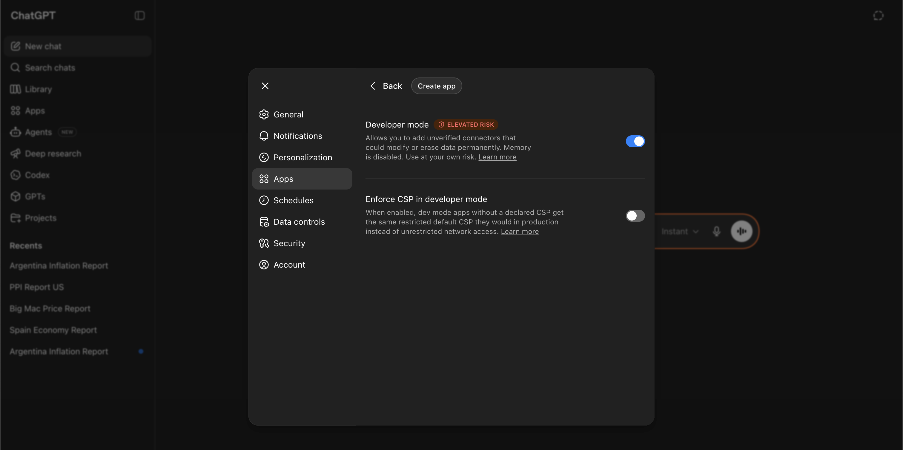
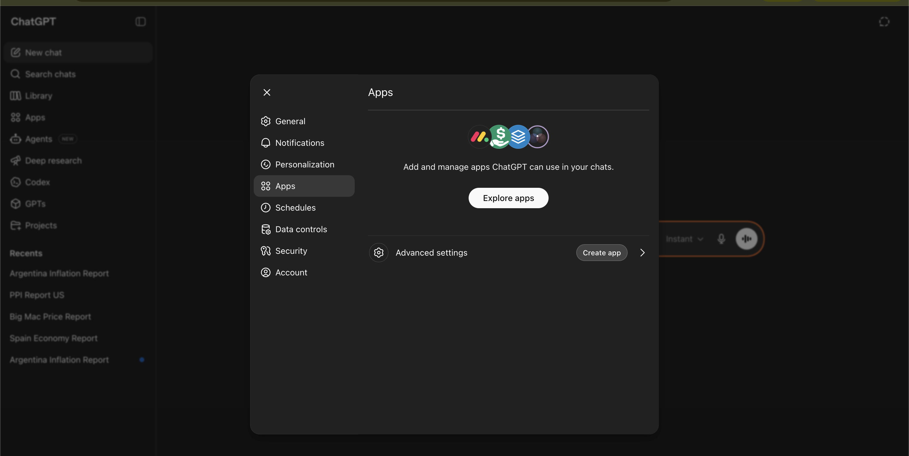

# Tako MCP Server

An MCP (Model Context Protocol) server that provides access to Tako's knowledge base and data visualizations.

## What is this?

This MCP server enables AI agents to:

- **Search** Tako's knowledge base for charts and live data, rendered as interactive charts
- **Answer** data questions with grounded, citation-backed prose
- **Fetch** underlying content (CSV or text) behind result URLs
- **Explore** Tako's data graph to see exactly what data exists for an entity or metric
- **Visualize** your own structured data as an embeddable chart
- **Run** Tako's Answer Agent for deep, multi-step research (opt-in — [enable it](#optional-tools-opt-in))

## Quick start

**Use the hosted endpoint at `https://mcp.tako.com`.** Three lines, no install:

```bash
export TAKO_API_TOKEN='<your-token-from-tako.com>'
claude mcp add tako-mcp --transport http https://mcp.tako.com/mcp \
  --header "Authorization: Bearer $TAKO_API_TOKEN"
```

That's it for new users. Detailed configs for Claude Code / Claude Desktop / Cursor / Windsurf are in the next section.

## Hosted (Cloudflare Workers)

The fastest path: point your MCP client at `https://mcp.tako.com` with a Bearer token. No install, no local server.

**Endpoints:**

| Environment | URL |
|---|---|
| Production | `https://mcp.tako.com/mcp` |
| Staging (testing only) | `https://mcp.staging.tako.com/mcp` |

**Authentication:** every request needs `Authorization: Bearer <TAKO_API_TOKEN>`. Get a token at [tako.com](https://tako.com) → account settings → API tokens.

### Claude Code

```bash
export TAKO_API_TOKEN='<your-token>'

claude mcp add tako-mcp --transport http https://mcp.tako.com/mcp \
  --header "Authorization: Bearer $TAKO_API_TOKEN"
```

Verify with `claude mcp list` (should show `tako-mcp` connected) or `/mcp` inside a session.

### Claude Desktop

Edit `~/Library/Application Support/Claude/claude_desktop_config.json` (macOS) or `%APPDATA%\Claude\claude_desktop_config.json` (Windows):

```jsonc
{
  "mcpServers": {
    "tako-mcp": {
      "type": "http",
      "url": "https://mcp.tako.com/mcp",
      "headers": {
        "Authorization": "Bearer <your-tako-api-token>"
      }
    }
  }
}
```

Restart Claude Desktop. `Tako MCP` should appear in the available tools list.

### Cursor / Windsurf

Add to `~/.cursor/mcp.json` (Cursor) or the equivalent Windsurf config:

```jsonc
{
  "mcpServers": {
    "tako-mcp": {
      "type": "http",
      "url": "https://mcp.tako.com/mcp",
      "headers": {
        "Authorization": "Bearer <your-tako-api-token>"
      }
    }
  }
}
```

### Notes

- **Tools are discovered automatically** via the MCP `tools/list` handshake on connect — your client always sees the current tool surface, no manual list to keep in sync.
- **Auth is connection-level Bearer** — once the connection is established with your token, tool inputs require no `api_token` argument.
- **Use the staging endpoint** (`mcp.staging.tako.com`) for testing changes against an unstable build before they reach `mcp.tako.com`.

## Consumer hosts (OAuth)

Use this if you're connecting Tako from **Claude.ai** or **ChatGPT** — the consumer chat hosts that don't accept Bearer tokens. The hosted endpoint at `https://mcp.tako.com/mcp` runs an OAuth 2.1 flow that signs you in with your Tako account and connects on your behalf, no JSON config or CLI required.

> If you're using Claude Code, Claude Desktop, Cursor, or Windsurf, see the Bearer-auth instructions [above](#hosted-cloudflare-workers) — those clients accept a static `Authorization: Bearer` header and don't need OAuth.

### Prerequisites

Before connecting from Claude.ai or ChatGPT, just **sign up or sign in at [tako.com](https://tako.com)** with the identity you'll use to authorize.

You do **not** need to mint an API token yourself. The consent flow mints a
per-host Tako API key for you on first authorize (named "MCP: <client>", visible
and revocable at tako.com → settings → API tokens). Minting is additive —
connecting a new host never rotates another host's key — and Tako trims your
oldest MCP key once you exceed ten. You only see a "too many API keys" page if
your account is at the overall key cap, in which case revoke one and reconnect.


### What you'll see during connect

The same three Tako-hosted screens appear regardless of which host (Claude.ai or ChatGPT) you're connecting from:

1. **Tako sign-in page.** Two options: **Continue with Google** or send yourself an **email magic-link**. Use the same identity you signed up with at tako.com.

   

2. **Tako consent page.** Reads *"Connect [host name] to Tako — Signed in as you@example.com — Allow / Cancel"*. Click **Allow** to authorize the connection.

   

3. **Bounce back to the host.** The connector is now listed and tools are callable.

The host itself (Claude.ai or ChatGPT) may also display its own consent prompt before or after Tako's. That's normal — Tako confirms it's safe to share your account; the host confirms it's safe to invoke an external connector.

### Claude.ai

*Requires Claude.ai Pro, Max, Team, or Enterprise.*

1. Open Claude.ai → **Settings → Connectors**.

   

2. Click **Add custom connector**.

3. Paste `https://mcp.tako.com/mcp` and click **Connect**.

4. You'll be taken through the Tako sign-in flow described above.

5. After consent, **Tako** appears in your connector list as connected.

### ChatGPT

*Requires ChatGPT Pro, Business, or Enterprise. Developer Mode must be enabled.*

1. Open ChatGPT → **Settings → Connectors → Developer Mode** and toggle it on if it isn't already.

   

2. Click **Create custom connector**.

   

3. Paste `https://mcp.tako.com/mcp` and click **Connect**.

4. You'll be taken through the Tako sign-in flow described above.

5. After consent, the connector is listed and ready to use.

   

### Verify it's working

In a fresh conversation, ask:

> Show me Tako's chart on Intel vs Nvidia headcount.

A successful response renders the chart inline within a few seconds — a fully interactive widget on ChatGPT, a chart image on other hosts — plus a link to the interactive chart. If you instead see an authentication error, jump to *Disconnecting & re-authorizing* below.

### Disconnecting & re-authorizing

There are two ways to break the connection, and they have different blast radius. Pick the one that matches what you actually want.

**Per-host disconnect** (Claude.ai or ChatGPT settings → remove the Tako connector). Stops *that host* from making MCP calls. Does **not** revoke the underlying Tako API token. Other connected hosts — and any Claude Code / Cursor Bearer-auth wiring on the same account — keep working unchanged.

**Rotate the API token at [tako.com](https://tako.com) → settings → API tokens.** This is the hard kill switch. Rotating creates a new token and invalidates the old one server-side, which means every previously-issued OAuth grant — across every host — stops authenticating immediately. To resume from any host, disconnect and reconnect; the new consent flow picks up your fresh token.

> This kill-switch behavior is by design for v1. Per-grant scoped tokens (revoke a single host without touching the others) are tracked under [TAKO-2679](https://linear.app/tako/issue/TAKO-2679)'s known limitations.

## Available Tools

Tools are discovered automatically via the MCP `tools/list` handshake; your client always sees the live surface. Auth is connection-level (Bearer token or OAuth) — there is no per-call `api_token` argument.

- **`tako_search`** — **Pull the actual data to work with.** Fast search over Tako's curated knowledge graph and the live web; each card carries a free inline preview of its latest rows by default (`include_contents`, on by default; set `false` for pointers-only). The top result renders inline as a chart — a fully interactive MCP Apps widget on ChatGPT, an inline chart image on every other host (Claude, Cursor, and the rest) — with an **Open in Tako** link to the interactive chart everywhere. **Parallelize it:** decompose a broad or multi-part question into several narrow, single entity+metric searches run concurrently (e.g. "US CPI inflation", "US core PCE inflation", …) rather than one broad query — narrow queries retrieve far better. Choose `sources` (`["data"]`, `["web"]`, or **both by default**) and `effort` (`fast` default | `instant`). For the full data (or a web page's text), call `tako_contents` on the result URL — for a Tako card, only when it's marked `exportable: true` (an `exportable: false` card has no exportable data). For deep, multi-step research — or when search returns nothing — use `tako_agent` (an [opt-in tool](#optional-tools-opt-in)).
- **`tako_answer`** — **Ask one specific, self-contained data question, get the answer.** A single grounded, citation-backed prose answer written for you (you don't touch the rows). Ground in `["data"]`, `["web"]`, or **both (default)**. For broad/multi-part needs, or when you want the underlying data to synthesize yourself, use `tako_search` (parallelized) instead; dig into a cited result's data with `tako_contents` (cards only when they're marked `exportable: true`).
- **`tako_contents`** — Fetch the content behind a result URL: a Tako card URL returns a CSV; any other URL returns the page's extracted text. Only cards marked `exportable: true` can be fetched — the export gate rejects `exportable: false` cards (web URLs are exempt from the gate).
- **`tako_available_data`** — See **what data Tako has** on an entity or metric in one call. It resolves the name to the top graph matches and summarizes, in natural language, the metrics Tako tracks for each — the live data it actually holds. Each match carries a `node_id` you can pin into `tako_search` / `tako_answer` for a strong retrieval boost. Runs graph search → the metrics drill internally; free and fast.
- **`tako_visualize`** — _Opt-in tool ([enable with `?tools=visualize`](#optional-tools-opt-in); on by default for ChatGPT)._ Create an embeddable chart/card directly from your own structured data (Tako's [Thin-Viz](https://tako.com/docs/) API). Supply typed `components` (timeseries, bar, table, financial boxes, …); the card auto-renders inline and returns `webpage_url` / `embed_url`.
- **`tako_agent`** — _Opt-in tool ([enable with `?tools=agent`](#optional-tools-opt-in))._ Run Tako's **Answer Agent**: opinionated, multi-step research for complex questions that need reasoning across many retrievals. Returns a synthesized, citation-backed answer plus supporting chart cards. Distinct from one-shot `tako_answer` (a single grounded lookup) — the agent is slower (~30–90s) but far more thorough. (On ChatGPT this is exposed as the `tako_agent_start` / `tako_agent_wait` pair to fit the host's tool-call timeout model.)
- **`get_credit_balance`** — _Opt-in tool ([enable with `?tools=credits`](#optional-tools-opt-in))._ Check the connected account's API credit balance.
- **`tako_graph_search`** / **`tako_graph_related`** / **`tako_graph_node`** — _Opt-in tools ([enable with `?tools=graph`](#optional-tools-opt-in))._ The low-level graph primitives behind `tako_available_data`, for power users who need what the one-call summary doesn't expose: traversal relations (`siblings`, `part_of`, `members`, `rel:*` named edges like `rel:competes_with`), server-side `q` filtering within a relation, cursor paging, and full node detail (aliases, subtype, description). Graph calls are free.

### Answer vs. Search — the core distinction

`tako_answer` and `tako_search` look similar but serve **opposite** needs. Pick by *what you want back*:

| You want… | Use | What you get back |
|---|---|---|
| **The answer** to one specific, self-contained data question | **`tako_answer`** | A single synthesized, citation-backed prose answer — **already written for you.** Relay it directly; no need to re-derive or double-check it. |
| **The data itself** — rows/time-series to compute over, chart, or turn into your own thesis | **`tako_search`** | Structured cards (each with a free row preview) + an inline chart. *You* do the synthesis. |

Rules of thumb:

- **One narrow, known question → `tako_answer`.** e.g. *"What was US GDP in 2024?"* The `answer` field comes back already LLM-synthesized and grounded in its citations — **surface it as-is**; you don't need to recompute it or call `tako_contents` to verify it.
- **Broad or multi-part → `tako_search`, parallelized.** Don't send a multi-part question to *either* tool as one call. Decompose it into narrow single **entity + metric** searches and fire them concurrently — e.g. *"US CPI inflation"*, *"US core CPI inflation"*, *"US PCE inflation"*, *"US core PCE inflation"* — then synthesize the four results yourself. Narrow queries retrieve far more accurately.
- In one line: **`tako_answer` hands you a conclusion; `tako_search` hands you the evidence.**

### Optional tools (opt-in)

To keep the default tool surface small (less context loaded into every session, fewer tools for the model to weigh), some tools are **off by default** and enabled per-connection via the `?tools=` query parameter on the MCP URL. The everyday tools (`tako_search`, `tako_answer`, `tako_contents`, `tako_available_data`) cover most questions; opt in to the rest as needed:

| Alias | Enables | What it's for |
|---|---|---|
| `agent` | `tako_agent` (ChatGPT: `tako_agent_start` / `tako_agent_wait`) | Deep, multi-step Answer Agent research |
| `visualize` | `tako_visualize` | Author charts from your own data (already on by default for ChatGPT, where it powers the widget) |
| `credits` | `get_credit_balance` | Check API credit balance |
| `graph` | `tako_graph_search`, `tako_graph_related`, `tako_graph_node` | Low-level graph traversal beyond `tako_available_data` (relations, filtering, paging, node detail) |

Aliases compose as a comma-separated list:

```
https://mcp.tako.com/mcp?tools=agent,visualize,credits
```

For example, with the CLI:

```bash
claude mcp add tako-mcp --transport http "https://mcp.tako.com/mcp?tools=agent" \
  --header "Authorization: Bearer $TAKO_API_TOKEN"
```

Only alias names are recognized (not raw tool names), and unknown values in `?tools=` are ignored, so a typo never breaks the connection. Omit the parameter entirely for the default surface.

## Example Flows

**Specific question → `tako_answer` (relay the answer):**
1. User asks: *"What was US GDP in 2024?"*
2. Agent calls `tako_answer` with the question
3. Agent receives a synthesized, citation-backed `answer` — and surfaces it directly, no further work needed

**Data to work with → parallel `tako_search` (synthesize yourself):**
1. User asks: *"Compare US CPI, core CPI, PCE, and core PCE inflation."*
2. Agent fires **four** narrow `tako_search` calls concurrently — one per entity+metric — instead of one broad query
3. Each returns a card with a free row preview (top result renders inline as a chart)
4. Agent synthesizes the four results into the comparison; calls `tako_contents` on a card's `webpage_url` if it needs the full rows (checking first that the card is marked `exportable: true` — `exportable: false` cards aren't exportable)

## Breaking changes (v0.3.0)

- The default tool surface is: **`tako_search`**, **`tako_answer`**, **`tako_contents`**, and **`tako_available_data`**. Everything else is [opt-in via `?tools=`](#optional-tools-opt-in): **`tako_agent`** (`agent`; on ChatGPT the split pair **`tako_agent_start`** / **`tako_agent_wait`**), **`tako_visualize`** (`visualize`; default-on for ChatGPT), **`get_credit_balance`** (`credits`), and the graph primitives **`tako_graph_search`** / **`tako_graph_related`** / **`tako_graph_node`** (`graph`).
- The chart-image (`get_chart_image`), interactive-chart (`open_chart_ui`), chart-creation (`create_chart`), and report tools (`create_report`, `get_report`, `list_reports`, `export_report`) were removed.
- The self-hosted Python server (`pip install tako-mcp` / Docker) was removed in favor of the hosted Cloudflare Worker.

Update any client config or agent prompts that referenced the old tool names or the Python SSE endpoint.

## Health Checks

- `GET /health` - Simple "ok" response

## Architecture

Tako MCP is a Cloudflare Worker — a thin TypeScript proxy deployed at `mcp.tako.com`:

```
AI Agent (Claude Code/Desktop, Cursor, Claude.ai, ChatGPT, etc.)
    ↓
  MCP Protocol (Streamable HTTP, POST /mcp)
    ↓
Cloudflare Worker  ──  Bearer auth / OAuth, tool dispatch
    ↓
Tako Django API  (tako.com)
```

The Worker extracts the Bearer token (or OAuth-derived token), validates the MCP request, calls the appropriate Django endpoint with the user's token forwarded as `X-API-Key`, and returns structured tool results. Code lives in `workers/` of this repo.

## MCP Registry (maintainers)

Tako is published to the official [MCP Registry](https://registry.modelcontextprotocol.io)
as a remote server under the name `io.github.TakoData/tako-mcp`.

- **`server.json`** (repo root) is the registry descriptor: a remote
  `streamable-http` entry pointing at `https://mcp.tako.com/mcp`. The registry
  schema does not list tools — hosts discover them at runtime via `tools/list`.
  (This is distinct from `registry/server.json`, the generated in-repo tool
  catalog used by `npm run registry:gen` / `registry:check`.)
- **Publishing** is automated by `.github/workflows/publish-mcp.yml`. It
  authenticates with the registry via **GitHub OIDC** (no secret — the
  `io.github.TakoData/*` namespace is authorized because this repo lives in the
  TakoData org) and runs `mcp-publisher publish`. **The version lives in code:**
  bump `server.json`'s `version` and merge to `main` and it publishes
  automatically. A merge that touches `server.json` without changing the version
  is a no-op (the workflow skips, so the registry never sees a duplicate). Manual
  `workflow_dispatch` publishes the checked-in version on demand.
- **Branded namespace (`com.tako/tako-mcp`)** is an optional future upgrade. It
  requires DNS authentication: generate an Ed25519 key, add a `TXT` record on
  `tako.com`, and swap the workflow's `login github-oidc` step for
  `login dns --domain tako.com --private-key ${{ secrets.MCP_PRIVATE_KEY }}`.

## Releases

Versioning and changelog are automated via release-please. Contributors use
Conventional Commit PR titles (squash-merge); maintainers cut a release by merging
the bot's "release: X.Y.Z" PR. See `AGENTS.md` → Releases.

## License

MIT License - see [LICENSE](LICENSE) for details.

## Links

- [Tako](https://tako.com) - Data visualization platform
- [Tako on Smithery](https://smithery.ai/servers/tako/tako) - MCP server listing (hosted Worker at `mcp.tako.com/mcp`)
- [Tako on the MCP Registry](https://registry.modelcontextprotocol.io) - `io.github.TakoData/tako-mcp`
- [MCP Specification](https://spec.modelcontextprotocol.io/) - Model Context Protocol
